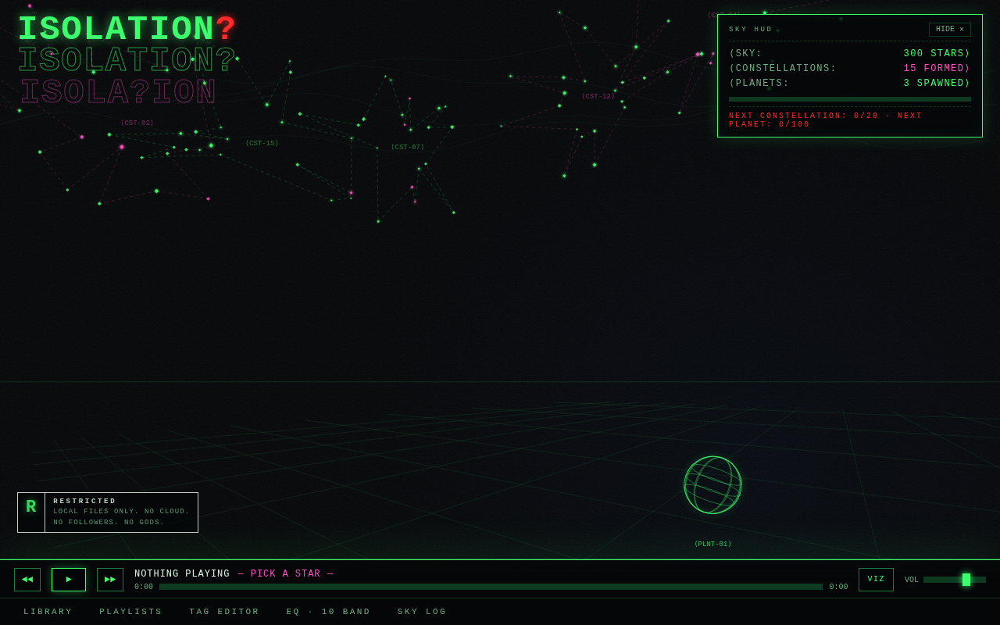
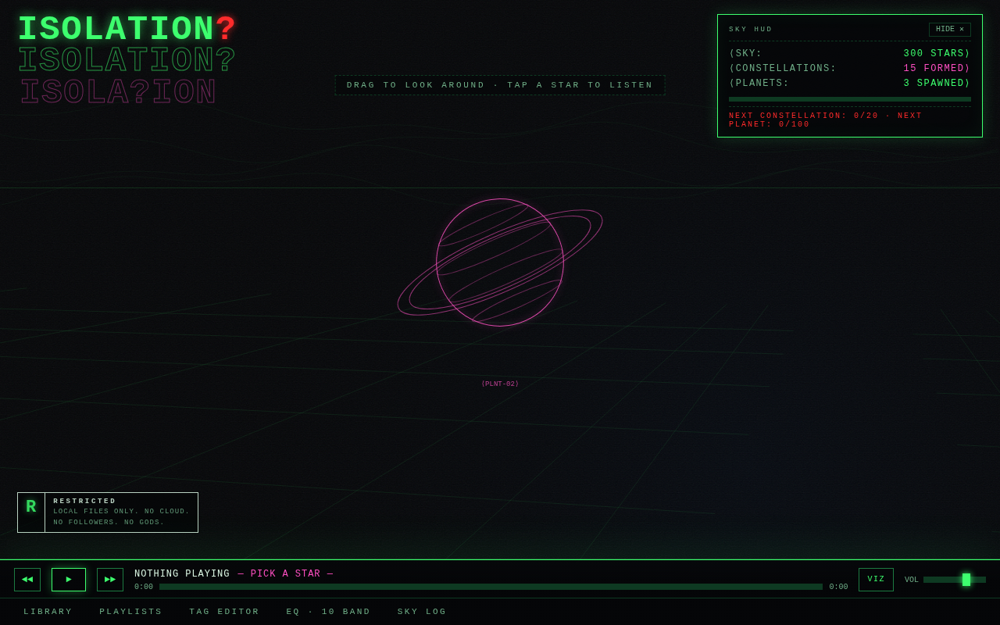
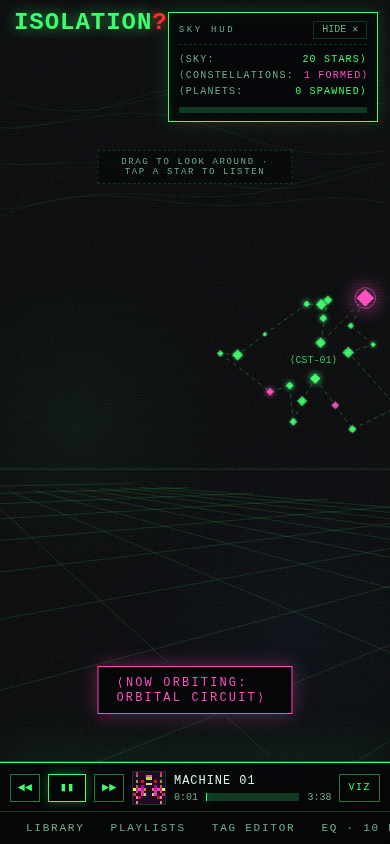

<div align="center">

# ISOLATION

**A local music player where your library becomes a night sky.**

[](https://github.com/0BrokenByDefault0/isolation/actions/workflows/ci.yml)
[](LICENSE)
[](package.json)

Every album you add spawns a star that glows brighter while you listen.
Every 20 albums wire together into a constellation.
Every 100 albums spawns a planet in your sky.



</div>

---

## Why

Music libraries deserve better than a spreadsheet. ISOLATION turns the act of
collecting into something you can see: a 3D celestial sphere that grows as
your library grows. It is entirely local — your files never leave the browser,
there is no server, no account, and no telemetry.

The visual identity is acid-print poster: grainy void black, wireframe green,
mesh pink, glitch red, CRT mono type.

## Features

- **A sky that grows with your library.** Albums are stars on a celestial
  sphere. Drag to rotate through a full 360 degrees, pinch or scroll to zoom.
  Constellations form at every 20 albums; planets spawn at every 100, each
  with its own palette, body type, tilt, rings, and moons.
- **Folder import with sensible album grouping.** One folder is one album.
  If the folder contains subfolders, each first-level subfolder becomes its
  own album, and deeper nesting (disc folders) collapses into its parent.
- **Metadata read straight from your files.** ID3v2.2/2.3/2.4, FLAC Vorbis
  comments and PICTURE blocks, and MP4/M4A atoms — including embedded
  artwork, which is rendered as a pixelated color mosaic.
- **A real 10-band equalizer.** A 31 Hz – 16 kHz biquad filter chain through
  Web Audio, with presets. Settings persist.
- **Playlists and tag editing.** Create and manage playlists; edit album and
  track metadata inline. Edits are stored in the library database — source
  files are never modified.
- **An audio-reactive visualizer, off by default.** Spectrum bars rise from
  the grid horizon, star glow breathes with the bass, constellation lines
  march. Driven by real FFT data for local files.
- **A persistent library.** File handles are stored in IndexedDB via the
  File System Access API, so the library survives reloads.

<div align="center">


</div>

## Quick start

```sh
git clone https://github.com/0BrokenByDefault0/isolation.git
cd isolation
npm install
npm run dev
```

Open the printed URL, then use **Library > Import Folder** and point it at
your music. Each album appears as a star; tap a star to play it.

To try the sky without local files, use the mock album buttons in the
Library panel to seed stars, constellations, and planets.

## Usage

| Action | Control |
| --- | --- |
| Look around | Drag the sky (mouse or touch) |
| Zoom | Scroll wheel, or two-finger pinch |
| Play an album | Tap its star, or pick it in Library |
| Toggle the visualizer | `VIZ` button in the transport |
| Hide the sky HUD | `HIDE` in the HUD panel |
| Playlists, tags, EQ | Tabs on the bottom hub |

## Browser support

| Browser | Playback | Library persists across reloads |
| --- | --- | --- |
| Chrome / Edge / Chromium | Yes | Yes (File System Access API) |
| Firefox | Yes | Metadata only; files re-import per session |
| Safari | Yes | Metadata only; files re-import per session |

## Architecture

Plain ES modules, no framework, no runtime dependencies. Vite is used only
for the dev server and build.

```
index.html          static shell (transport hub, panels, HUD)
src/main.js         boot: load persisted state, init UI, init sky
src/state.js        app state, persistence, file-handle resolution
src/db.js           IndexedDB wrapper (albums, playlists, settings)
src/importer.js     folder walking and the album grouping rule
src/tags.js         ID3v2 / FLAC / MP4 tag and artwork parser
src/pixel.js        artwork pixelation and generated sprites
src/audio.js        audio element -> 10x BiquadFilter -> gain -> analyser
src/sky.js          3D celestial sphere renderer and camera
src/ui.js           transport, panels, playlists, tag editor, EQ
```

The renderer is a single 2D canvas doing its own perspective projection:
stars are unit vectors on a sphere around the camera, constellation bearings
follow a golden-angle spiral so groups never overlap, and the ground grid is
world-fixed so it swings as the view yaws.

## Development

```sh
npm run dev        # dev server with hot reload
npm run build      # production build to dist/
npm run preview    # serve the production build
```

Opening the app with `#debug` in the URL exposes `window.__sky` with a
camera `aim(dir, zoom)` helper, used by tests and handy for development.

## Contributing

See [CONTRIBUTING.md](CONTRIBUTING.md). Bug reports about folder import are
especially useful when they describe the folder layout.

## License

[AGPL-3.0](LICENSE). If you modify ISOLATION and run it as a hosted
service, the AGPL requires you to make your modified source available to
its users.
